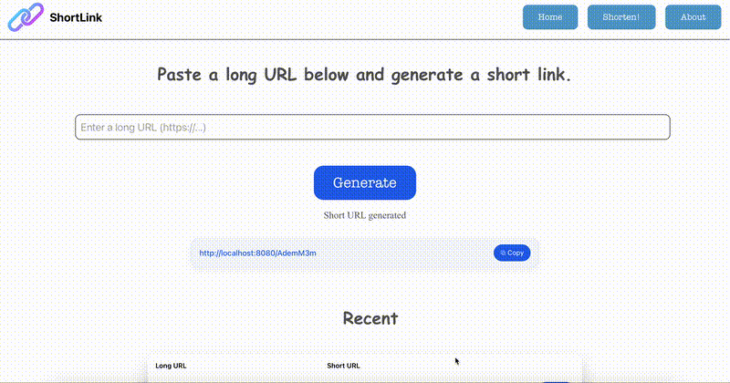

# ShortLink

ShortLink is a full-stack URL shortening platform that converts long URLs into compact, easy-to-share links using 7-character identifiers.

---

## Features

- Generate short URLs from long links
- Redirect short links to their original destinations
- Dockerized setup for easy local development
- Clear separation of frontend, backend, and database services

---

## Tech Stack:

- **Frontend:** React  
- **Backend:** Spring Boot  
- **Database:** PostgreSQL  
- **Infrastructure:** Nginx, Docker, Docker Compose  

---

## Demo 



---

## Getting Started

### Prerequisites

- Docker
- Docker Compose

All services run inside Docker containers. No local installation of Java, Node.js, PostgreSQL, or Nginx is required.


### Configuration

1. Update `application.properties.template` with fallback values for your local PostgreSQL setup.

2. Create a `.env` file in the project root with the following variables:

```env
SPRING_DATASOURCE_URL=
SPRING_DATASOURCE_USERNAME=
SPRING_DATASOURCE_PASSWORD=
```

### Running:

`docker-compose up --build`

Launches the dockerized project (including the backend, frontend, and database).

Visit `http://localhost:3000` to see the result.

### Default Ports

- Frontend: `http://localhost:3000`
- Backend / API: `http://localhost:8080`
- PostgreSQL: `5432` (internal or exposed depending on Docker config)


---

## To-Do

- Deploy the application to AWS
- Store shortened URLs using cloud infrastructure
- Add authentication and rate limiting
- Save the URLs to cache
- Implement analytics (click tracking, expiration, etc.)

---

## License

This project is licensed under the MIT License.